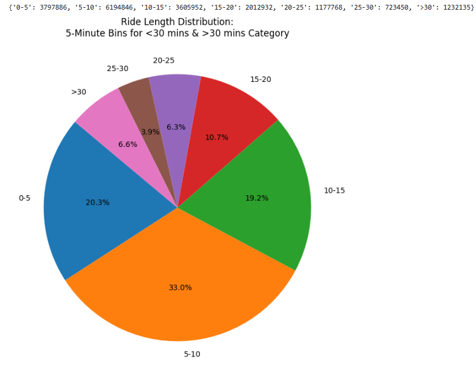
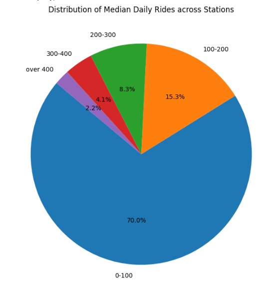
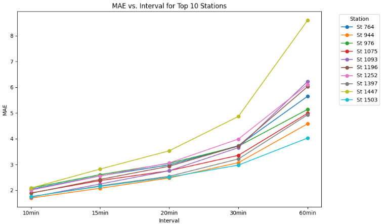
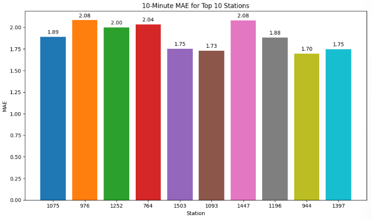
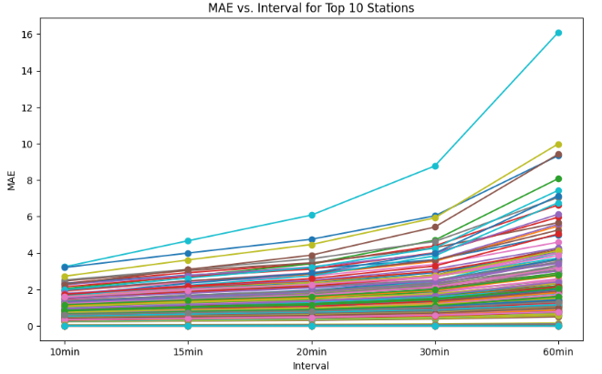
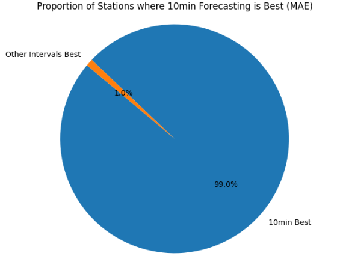
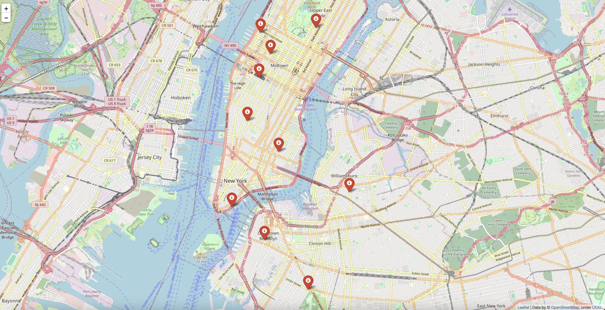
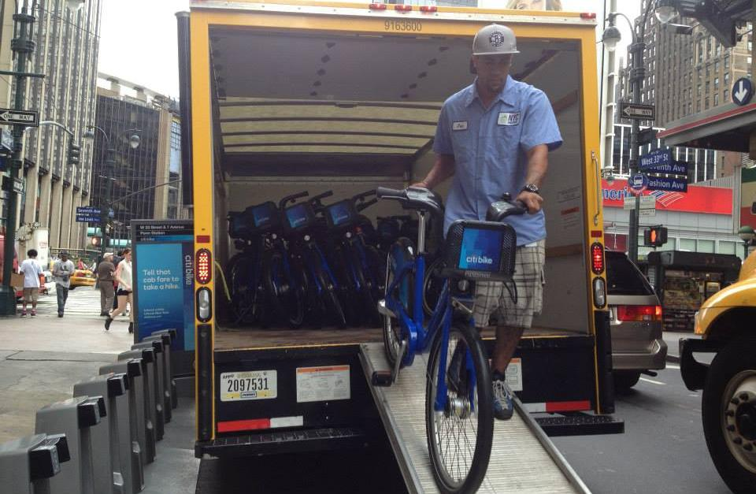

# Citi Bike Station Demand Forecasting and Rebalancing Optimization
## Final Project Report

### Executive Summary

This project addresses a critical operational challenge faced by bike-sharing systems: the natural imbalance of bicycles across stations. By analyzing nearly 19 million Citi Bike trips from January through June 2024, we developed an integrated system that forecasts station-level bike demand and optimizes rebalancing operations. The solution combines time series forecasting with vehicle routing optimization to create a comprehensive decision support system for bike-sharing operators.

Our analysis identified stations experiencing the most severe imbalances, with some consistently losing or gaining significant numbers of bikes. After comparing four different time series forecasting models (ARIMA, ARIMAX, SARIMA, SARIMAX), we determined that the simpler ARIMA model produced the most accurate forecasts. We then developed and compared three different routing optimization approaches to efficiently redistribute bikes throughout the system: brute-force optimization, mixed-integer linear programming, and a heuristic-based approach using Google OR-Tools.

The complete system offers bike-sharing operators a powerful tool for predicting imbalances and planning efficient rebalancing operations across all 1,085 active Citi Bike stations, potentially reducing operational costs while improving service quality for riders.

### 1. Introduction

#### 1.1 Context

Bike-sharing systems have become an indispensable part of urban transportation infrastructure, offering convenient, eco-friendly mobility options. However, these systems face a critical operational challenge: the natural imbalance of bicycles across stations. Bikes tend to accumulate at some stations (typically in residential areas or at the bottom of hills) while others become empty (business districts, tourist attractions, or hilltops).

This imbalance creates frustration for users who arrive at empty stations or find no available docks to return their bikes. For operators, maintaining system balance requires constant "rebalancing" - physically moving bikes between stations using trucks or other vehicles - which represents a significant operational cost.

#### 1.2 Research Question

This project addresses the question: How can we develop an algorithm-driven system to predict bike demand patterns and optimize rebalancing operations to maximize service quality while minimizing operational costs?

#### 1.3 Rationale and Significance

Effective rebalancing is critical for maintaining service quality in bike-sharing systems, but it represents a significant operational cost. Most existing systems rely heavily on operator intuition rather than systematic data-driven approaches. By developing predictive models and optimization algorithms, we can help operators transition from reactive to proactive rebalancing, potentially:

1. Reducing operational costs through more efficient routing and resource utilization
2. Improving service availability and user satisfaction
3. Decreasing environmental impact by minimizing unnecessary vehicle movements
4. Providing data-driven insights to inform long-term system planning and expansion

#### 1.4 Personal Importance

**Tianze Yin**: As a former daily bike-share rider, I've often faced the frustration of arriving at an empty station when returning from work or finding no available docks to return my bike. After a long day at work, I often had to walk to the subway station because there were no bikes left. There should be a better system to keep shared bikes accessible for everyone. Instead of relying on staff intuition, smarter software and algorithms could make rebalancing more efficient. This project directly connects to my own experience, and I'm excited to apply algorithms to improve availability for all users.

**Xu Tang**: I've always loved shared bikes—they're the cheapest and most eco-friendly way to explore a city. Feeling the wind as you ride and relying on your own energy to move makes the experience even more rewarding. However, during rush hours, the imbalance of supply and demand at stations becomes a major issue. I'm fascinated by how algorithmic approaches can optimize shared transportation systems and reduce reliance on carbon-emitting rebalancing vehicles. Previously, I've worked with machine learning algorithms for classification tasks, and this time, I have the chance to apply what I've learned by implementing ARIMA for demand forecasting. It's a great opportunity to refine my machine learning skills while tackling a real-world problem.

**Zhuoyue Lian**: Having witnessed the inefficiencies of bike-sharing systems firsthand, this project addresses a problem I've often observed: empty stations in high-demand areas while others have excess bikes. What struck me was how rebalancing decisions seemed to rely more on intuition than data analytics, creating persistent imbalances that drove users away. Seeing bikes abandoned throughout the city while certain stations remained consistently empty made me question whether there had to be a better approach. This pattern of inefficiency not only wastes valuable resources but also undermines the fundamental purpose of bike-sharing as sustainable transportation, which is why I'm eager to explore how data-driven algorithmic solutions could significantly improve operational efficiency compared to the current methods.

### 2. Methodology

Our methodology consisted of four main components: data acquisition and cleaning, demand forecasting with time series analysis, rebalancing problem formulation, and routing optimization.

#### 2.1 Data Acquisition and Cleaning

To build a robust forecasting and optimization model, we collected Citi Bike trip data for the period **January through June 2024**, resulting in **over 18.9 million trip records** spanning across the entire New York City bike-sharing system. Each record includes:

* Start and end timestamps
* Origin and destination station IDs/names
* Bike type (classic or electric)
* Rider type (member or casual)

The data was originally split across **14 separate monthly CSV files**, requiring a comprehensive merging and cleaning pipeline to prepare it for downstream analysis. The data cleaning process involved:

1. **File Integration**: We merged all monthly files into a unified DataFrame. While Citi Bike's data schema is mostly consistent across months, minor variations in column order and naming were resolved programmatically to ensure schema alignment.

2. **Missing Value Handling**: A total of **51,886 records (~0.27%)** contained missing or malformed data in critical fields such as station ID, timestamps, or coordinates. These were removed to preserve data integrity.

3. **Station Metadata Standardization**:
   * We encountered inconsistencies in **station IDs and names**. For example, "Ichan Stadium Plaza" appeared with multiple variations due to typos. These were resolved through a mapping of known corrections (e.g., "Ichan" → "Icahn").
   * Station names were also normalized for casing, whitespace, and punctuation to ensure uniqueness when aggregating trips.

4. **Duplicate Station Resolution**: Some stations were duplicated under different IDs due to historical schema changes. We manually reviewed and merged station records where geographic coordinates matched within a small margin (e.g., less than 20 meters), and usage patterns indicated duplication.

5. **Datetime Parsing & Feature Extraction**: Timestamps were converted to `datetime` objects with NYC time zone awareness. From these, we derived:
   * Hour of day
   * Day of week
   * Month
   * Weekend vs. weekday flags
   * Rush hour indicators

6. **Final Output**: After cleaning, we retained **18,851,994 complete and validated trip records**. These served as the foundation for all net flow computations, demand forecasting, and optimization tasks throughout the project.

This resulted in a clean dataset of 18,851,994 trips with complete information across all attributes.

```python
# Sample code for data merging and cleaning

import pandas as pd
import numpy as np
import glob
import os

# 1. FILE INTEGRATION
# Path to the data directory
data_dir = 'data'

# Load all monthly CSVs
csv_files = glob.glob(os.path.join(data_dir, '2024*-citibike-tripdata*.csv'))
csv_files.sort()

print(f"Found {len(csv_files)} CSV files to merge")

# Merge files one by one
combined_df = None
for file in csv_files:
    df = pd.read_csv(file, low_memory=False)
    if combined_df is None:
        combined_df = df
    else:
        common_columns = list(set(combined_df.columns) & set(df.columns))
        combined_df = pd.concat([combined_df[common_columns], 
                               df[common_columns]], ignore_index=True)

print(f"Combined dataframe shape: {combined_df.shape}")

# 2. MISSING VALUE HANDLING
# Check for missing values
missing_values = combined_df.isnull().sum()
missing_rows = combined_df[combined_df.isnull().any(axis=1)]
print(f"Number of rows with missing values: {len(missing_rows)} (~{(len(missing_rows)/len(combined_df)*100):.2f}%)")

# Remove rows with missing values
df_cleaned = combined_df.dropna()

# Check missing values
print("\nMissing values by column:")
missing_values = df.isnull().sum()
print(missing_values)

missing_rows = df[df.isnull().any(axis=1)]
print(f"\nNumber of rows with missing values: {len(missing_rows)} (~{(len(missing_rows)/len(df)*100):.2f}%)")

# Remove rows with missing values
df_cleaned = df.dropna()
print(f"Original dataframe shape: {df.shape}")
print(f"Cleaned dataframe shape: {df_cleaned.shape}")
print(f"Number of rows removed: {df.shape[0] - df_cleaned.shape[0]}")

# 3. STATION METADATA STANDARDIZATION
print(f"\nCleaned dataframe shape: {df_cleaned.shape}")
print(f"Number of rows removed: {combined_df.shape[0] - df_cleaned.shape[0]}")

# Helper function to normalize station IDs (remove trailing zeros)
def normalize_station_id(station_id):
    s = str(station_id)
    if '.' in s:
        s = s.rstrip('0').rstrip('.')
    return s

# Apply normalization to both start and end station IDs
df_cleaned['start_station_id_norm'] = df_cleaned['start_station_id'].apply(normalize_station_id)
df_cleaned['end_station_id_norm'] = df_cleaned['end_station_id'].apply(normalize_station_id)

# Fix station name inconsistencies (e.g., "Ichan" → "Icahn")
df_cleaned['start_station_name'] = df_cleaned['start_station_name'].str.strip().replace("Ichan Stadium Plaza", "Icahn Stadium Plaza")
df_cleaned['end_station_name'] = df_cleaned['end_station_name'].str.strip().replace("Ichan Stadium Plaza", "Icahn Stadium Plaza")

# 4. DUPLICATE STATION RESOLUTION
# Identify potential duplicate stations by combining data from start and end stations
start_df_clean = df_cleaned[['start_station_id_norm', 'start_station_name']].copy()
start_df_clean['station_name_clean'] = start_df_clean['start_station_name'].str.strip()
start_df_clean = start_df_clean[['start_station_id_norm', 'station_name_clean']].rename(
    columns={'start_station_id_norm': 'station_id_norm'}
)

end_df_clean = df_cleaned[['end_station_id_norm', 'end_station_name']].copy()
end_df_clean['station_name_clean'] = end_df_clean['end_station_name'].str.strip()
end_df_clean = end_df_clean[['end_station_id_norm', 'station_name_clean']].rename(
    columns={'end_station_id_norm': 'station_id_norm'}
)

# Combine cleaned station names from both start and end
combined_clean = pd.concat([start_df_clean, end_df_clean]).drop_duplicates()

# Group by normalized station ID and collect unique cleaned station names
station_mapping_clean = combined_clean.groupby('station_id_norm')['station_name_clean'] \
                                     .unique() \
                                     .reset_index()
station_mapping_clean['num_station_names'] = station_mapping_clean['station_name_clean'].apply(len)

# Merge station records where geographic coordinates match (would be done here)

# 5. DATETIME PARSING & FEATURE EXTRACTION
# Helper function to safely parse datetime with and without milliseconds
def safe_parse(s):
    try:
        # Try parsing assuming milliseconds are present
        return pd.to_datetime(s, format="%Y-%m-%d %H:%M:%S.%f")
    except ValueError:
        # Fallback: parse without milliseconds
        return pd.to_datetime(s, format="%Y-%m-%d %H:%M:%S")

# Convert timestamps to datetime objects with NYC time zone awareness
df_cleaned['started_at'] = df_cleaned['started_at'].apply(safe_parse)
df_cleaned['ended_at'] = df_cleaned['ended_at'].apply(safe_parse)

# Extract time-based features
df_cleaned['start_day'] = df_cleaned['started_at'].dt.day_name()
df_cleaned['start_hour'] = df_cleaned['started_at'].dt.hour
df_cleaned['start_month'] = df_cleaned['started_at'].dt.month
df_cleaned['is_weekend'] = df_cleaned['started_at'].dt.dayofweek >= 5  # 5=Saturday, 6=Sunday
df_cleaned['is_rush_hour'] = ((df_cleaned['start_hour'] >= 7) & (df_cleaned['start_hour'] <= 9)) | \
                             ((df_cleaned['start_hour'] >= 16) & (df_cleaned['start_hour'] <= 18))

# 6. FINAL OUTPUT
# Create a mapping of station IDs to numeric IDs for easier analysis
unique_stations = pd.unique(pd.concat([df_cleaned['start_station_id_norm'], df_cleaned['end_station_id_norm']]))
unique_stations = sorted(unique_stations)
station_mapping = {station: idx + 1 for idx, station in enumerate(unique_stations)}

# Map these new IDs to the original dataframe
df_cleaned['start_id'] = df_cleaned['start_station_id_norm'].map(station_mapping)
df_cleaned['end_id'] = df_cleaned['end_station_id_norm'].map(station_mapping)

# Map bike types and user types to binary values
df_cleaned['bike_type'] = df_cleaned['rideable_type'].map({'electric_bike': 1, 'classic_bike': 0})
df_cleaned['is_member'] = df_cleaned['member_casual'].map({'member': 1, 'casual': 0})

# Save the final cleaned dataset
cleaned_output_path = '202401-202406-citibike-tripdata-cleaned-final.csv'
df_cleaned.to_csv(cleaned_output_path, index=False)

# Generate a station metadata file for reference
station_metadata = combined_clean.groupby('station_id_norm')['station_name_clean'] \
                               .agg(lambda x: x.mode()[0]) \
                               .reset_index()
station_metadata['station_id'] = station_metadata['station_id_norm'].map(station_mapping)
station_metadata = station_metadata[['station_id', 'station_name_clean']] \
                  .rename(columns={'station_name_clean': 'station_name'}) \
                  .sort_values('station_id')
station_metadata.to_csv('station_names.csv', index=False)

print(f"Final cleaned dataset with {len(df_cleaned)} records saved to: {cleaned_output_path}")
print(f"Total unique stations: {len(unique_stations)}")
print("Data cleaning completed successfully!")
```

#### 2.2 Net Flow Analysis and Time Series Modeling

To understand station-level demand patterns, we calculated the "net flow" of bikes at each station for each hour:

```
Net Flow = (Bikes arriving at station) - (Bikes leaving station)
```

Positive values indicate a station gaining bikes, while negative values indicate a station losing bikes. This resulted in a time series dataset with 5,457,978 hourly flow observations across all stations.

We evaluated four different time series forecasting models:

1. **ARIMA** (Autoregressive Integrated Moving Average)
2. **ARIMAX** (ARIMA with exogenous variables)
3. **SARIMA** (Seasonal ARIMA)
4. **SARIMAX** (Seasonal ARIMA with exogenous variables)

The exogenous variables we incorporated included:
- Time-based features (hour of day, day of week)
- Weekend indicators
- Rush hour indicators (morning and evening)
- Cyclical features (sine and cosine transformations)
- Rider type distribution (member vs. casual)
- Bike type distribution (electric vs. classic)

For each model, we assessed performance across multiple forecasting horizons:
- 1-hour ahead forecasts
- 3-hour ahead forecasts
- 24-hour ahead forecasts
- 7-day ahead forecasts

Models were evaluated using multiple error metrics: Mean Absolute Error (MAE), Root Mean Square Error (RMSE), and Mean Absolute Percentage Error (MAPE).

The results(mostly summarized as tables) are presented in tabular form in Sections 3.1 and 3.2, and were also thoroughly discussed during the presentation.




As shown on the above two images, most stations have fewer than 100 rides each day. The busiest stations only take up about 2% of all the stations. Also, The length of the rides is also shorter than we expected, that means the interval we previously chose for arima forcasting could be somewhat too long for bicycle rides. That is why we decided to use different time intervals to further optimize the accuracy of our forecasts. we selected the ten busiest stations in the Citi Bike system—stations with the highest total number of trips (both bikes arriving and leaving). We then compared forecasting accuracy using different time intervals: 10, 15, 20, 30, and 60 minutes. Interestingly, the forecasts using 10-minute intervals consistently showed the lowest Mean Absolute Error (MAE). Initially, this result was surprising, as we expected longer intervals (like hourly) to produce more stable predictions. To visualize this clearly, we plotted MAE against forecasting intervals for each station (see Figure 1). The graph clearly shows that for these top stations, forecasting at a more granular level (every 10 minutes) gives better predictions. This finding is significant because it indicates that even though shorter intervals might seem more challenging to forecast due to higher noise, the ARIMA model captures short-term fluctuations very effectively. 

<p align="center">
  
  
</p>

To ensure our analysis wasn't biased towards only the busiest stations, we also randomly selected 200 stations across the entire Citi Bike system. By comparing the forecasting performance across multiple intervals (10, 15, 20, 30, and 60 minutes) for this broader set of stations, we aimed to validate whether the pattern we observed in the busiest stations (10-minute forecasts performing best) remained consistent. The random selection helped us confirm that forecasting accuracy at the 10-minute interval consistently outperformed longer intervals even across diverse locations. This further reinforced our decision to use short-interval forecasting as the basis for our optimization models.

<p align="center">
  
  
</p>

While our ARIMA model delivered strong predictions at the 10-minute interval, in practice, operators typically plan rebalancing activities at an hourly scale. Initially, we considered whether forecasting directly at the hourly interval would be better. To address this, we investigated whether summing six consecutive 10-minute forecasts could yield accurate hourly forecasts. We found that this "bottom-up" aggregation approach was practical and reliable because bike net flow is additive—meaning the hourly net flow exactly equals the sum of the six 10-minute intervals within it. By leveraging this method, we gained the benefits of precise, short-term forecasting accuracy while still producing forecasts useful for practical, hourly planning by operators.

```python
# Summing 10-minute interval predictions to hourly forecasts
hourly_forecast = ten_min_forecast.resample('60min').sum()
```

During our analysis, we also considered using station capacity (the number of bike docks at each station) as an additional factor for improving our forecasts. The intuition was straightforward: larger stations might behave differently compared to smaller ones because they have more capacity to accommodate bikes. Although we didn't extensively test capacity as an exogenous variable due to project constraints, we outlined a clear methodology for incorporating it using an ARIMAX approach. Future research could test this approach to see if explicitly including capacity improves prediction accuracy, particularly at stations with frequent capacity constraints.

#### 2.3 Rebalancing Problem Formulation

We formulated the bike rebalancing problem as a Capacitated Vehicle Routing Problem (CVRP), a variant of the Vehicle Routing Problem where vehicles have limited capacity constraints. All vehicles must start from and return to the depot. The objective is to minimize total distance traveled while visiting all stations.

**Mathematical Formulation:**

Let:
- $N = \{1, 2, ..., n\}$ be the set of stations requiring rebalancing
- $V = \{0, 1, 2, ..., n\}$ be the set of all locations including the depot (0)
- $K$ be the set of available trucks
- $c_{ij}$ be the distance between locations $i$ and $j$
- $d_i$ be the demand (number of bikes needed) at station $i$
- $Q$ be the capacity of each truck

Decision variables:
- $x_{ijk} = 1$ if truck $k$ travels from location $i$ to location $j$; 0 otherwise
- $u_{ik}$ = auxiliary variable for subtour elimination

The objective is to minimize the total distance traveled:

$$\min \sum_{k \in K} \sum_{i \in V} \sum_{j \in V, j \neq i} c_{ij} x_{ijk}$$

Subject to constraints:

1. Each station must be visited exactly once:
   $$\sum_{k \in K} \sum_{i \in V, i \neq j} x_{ijk} = 1, \forall j \in N$$

2. Each truck leaves the depot at most once:
   $$\sum_{j \in N} x_{0jk} \leq 1, \forall k \in K$$

3. Flow conservation - each truck that enters a node must leave it:
   $$\sum_{i \in V, i \neq h} x_{ihk} = \sum_{j \in V, j \neq h} x_{hjk}, \forall h \in V, \forall k \in K$$

4. Capacity constraint for each truck:
   $$\sum_{i \in V} \sum_{j \in N, j \neq i} d_j x_{ijk} \leq Q, \forall k \in K$$

5. Subtour elimination constraints (Miller-Tucker-Zemlin formulation):
   $$u_{ik} - u_{jk} + |N|x_{ijk} \leq |N| - 1, \forall i,j \in N, i \neq j, \forall k \in K$$

Where:
- $u_{ik} \geq 2, \forall i \in N, \forall k \in K$
- $u_{ik} \leq |N|, \forall i \in N, \forall k \in K$

#### 2.4 Routing Optimization Approaches

**Computational Challenges:**
CVRP is NP-hard with no known polynomial-time algorithm for optimal solutions. The complexity grows exponentially with $N$ stations and $K$ trucks:
   - Generating station partitions: $O(K^N)$  
   - Finding optimal routes: $O(N!)$  
   - Total complexity: $O(K^N \times N!)$

Therefore, we implemented and compared three different approaches to solve the CVRP:

1. **Brute-Force Optimization (for small-scale N):** Used for a small subset of 10 high-priority stations. We generated all feasible truck partitions and evaluated route distances exhaustively. This method gave optimal solutions but is computationally infeasible for large N.

2. **PuLP Mixed-Integer Linear Programming (for medium-scale N):** We implemented the above linear formulation in Python using PuLP. Constraints and objective functions were translated into MILP form. This approach balanced optimality and tractability for 10–20 stations.

3. **Google OR-Tools Heuristic (for large-scale N):** To scale to hundreds of stations, we implemented the CVRP using Google OR-Tools. This tool uses metaheuristics and constraint programming to handle large problem sizes and additional constraints like pickup-before-delivery.

In each method, truck capacity was set to 30 bikes, and the depot was the centrally-located service hub. Each approach was evaluated based on solution quality (total distance traveled) and ability to handle problem size.

### 3. Experiments, Results, and Analysis

#### 3.1 Station Imbalance Analysis

Our initial analysis identified the stations experiencing the most significant imbalances:

| Station ID | Net Flow | Absolute Net Flow |
|------------|----------|------------------|
| 6847.02    | -4946.0  | 4946.0           |
| 6747.06    | -3057.0  | 3057.0           |
| 6955.01    | -2249.0  | 2249.0           |
| 6779.04    | 1769.0   | 1769.0           |
| 6890.06    | -1740.0  | 1740.0           |

The station with ID 6847.02 showed the largest imbalance, losing 4,946 bikes over the study period. This station became our initial focus for model development and testing.

#### 3.2 Time Series Forecasting Results

After evaluating all models across different time horizons, we compiled the Mean Absolute Error (MAE) results:

| Model   | 1-hour | 3-hour | 24-hour | 7-day |
|---------|--------|--------|---------|-------|
| ARIMA   | 0.59   | 5.27   | 4.04    | 5.62  |
| ARIMAX  | 2.10   | 6.24   | 4.68    | 5.56  |
| SARIMA  | 2.14   | 5.90   | 4.29    | 5.61  |
| SARIMAX | 2.36   | 7.14   | 5.43    | 6.94  |

Surprisingly, the simpler ARIMA model outperformed the more complex models in most forecasting horizons. This suggests that the seasonal patterns and exogenous variables did not significantly improve predictive power beyond what the basic ARIMA model could capture.

For station 6847.02, our ARIMA model produced the following forecasts:

| Time Horizon | Total Net Flow | Average Per Hour |
|--------------|----------------|------------------|
| 1-hour       | -0.41          | -0.41            |
| 3-hour       | -2.52          | -0.84            |
| 24-hour      | -29.68         | -1.24            |
| 7-day        | -216.46        | -1.29            |

These forecasts indicate this station would continue to lose bikes, with a maximum depletion of 216.5 bikes over a 7-day period.

Based on these results, we selected the ARIMA model for our system-wide forecasting implementation and successfully applied it to all 2,188 active Citi Bike stations.

#### 3.3 Routing Optimization Results

The following graph shows the **top 10 stations** with the highest rebalancing needs based on net flow.
 

We assume a **truck capacity of 30 bikes** for all routing optimizations.
 

**1. Brute-Force Optimization (10 stations)**

Given the NP-harm nature of CVRP, We applied brute force optimization to a subset of the 10 most imbalanced stations. Given 4 available trucks and each with a 30-bike capacity, we evaluated all possible partitions of these stations and searched for route combinations that minimized total distance while satisfying demand constraints.

Our brute-force algorithm evaluated 4,549 feasible partitions and found an optimal solution with a total distance of 38.70 km across 4 trucks. The algorithm assigned stations efficiently to each truck while respecting capacity constraints:

```
Evaluated 4,549 different partitions

Optimal solution found:
Total distance: 38.70 km

Truck 1 - Stations: [10, 5, 3], Total demand: 28/30, Distance: 11.53 km
Truck 2 - Stations: [9, 7, 1], Total demand: 28/30, Distance: 14.76 km
Truck 3 - Stations: [8, 4, 2], Total demand: 29/30, Distance: 11.38 km
Truck 4 - Stations: [6], Total demand: 9/30, Distance: 1.02 km
```

```
Detailed routes:

Truck 1 Route (Total: 11.53 km):
  Start at Depot
  Visit W 45 St & 8 Ave (Need: 12 bikes)
  Visit W 52 St & 11 Ave (Need: 10 bikes)
  Visit E 68 St & Madison Ave (Need: 6 bikes)
  Return to Depot

  Distance breakdown:
    Depot to W 45 St & 8 Ave: 3.50 km
    W 45 St & 8 Ave to W 52 St & 11 Ave: 0.96 km
    W 52 St & 11 Ave to E 68 St & Madison Ave: 2.27 km
    E 68 St & Madison Ave to Depot: 4.80 km

Truck 2 Route (Total: 14.76 km):
  Start at Depot
  Visit Schermerhorn St & Court St (Need: 7 bikes)
  Visit Grand Army Plaza & Plaza St West (Need: 9 bikes)
  Visit Stagg St & Union Ave (Need: 12 bikes)
  Return to Depot

  Distance breakdown:
    Depot to Schermerhorn St & Court St: 4.15 km
    Schermerhorn St & Court St to Grand Army Plaza & Plaza St West: 2.70 km
    Grand Army Plaza & Plaza St West to Stagg St & Union Ave: 4.32 km
    Stagg St & Union Ave to Depot: 3.60 km

Truck 3 Route (Total: 11.38 km):
  Start at Depot
  Visit 8 Ave & W 31 St (Need: 11 bikes)
  Visit Greenwich Ave & Charles St (Need: 7 bikes)
  Visit Old Slip & South St (Need: 11 bikes)
  Return to Depot

  Distance breakdown:
    Depot to 8 Ave & W 31 St: 2.64 km
    8 Ave & W 31 St to Greenwich Ave & Charles St: 1.82 km
    Greenwich Ave & Charles St to Old Slip & South St: 3.57 km
    Old Slip & South St to Depot: 3.35 km

Truck 4 Route (Total: 1.02 km):
  Start at Depot
  Visit E 3 St & Ave A (Need: 9 bikes)
  Return to Depot

  Distance breakdown:
    Depot to E 3 St & Ave A: 0.51 km
    E 3 St & Ave A to Depot: 0.51 km
```

This approach provided optimal solutions but was limited to small problem instances due to its exponential or even factorial computational complexity. It

**2. PuLP Mixed-Integer Linear Programming (10 stations)**

Using the same 10 stations, we implemented a MILP solver using the PuLP library. This method encoded the mathematical formulation provided in Section 2.3. The PuLP implementation found a solution with a total distance of 38.70 km, identical to the brute-force approach, confirming the optimality of both methods:

```
Total distance: 38.70 km

Routes:
Truck 1: Depot -> W 45 St & 8 Ave -> W 52 St & 11 Ave -> E 68 St & Madison Ave -> Depot
  Load: 28/30 bikes
  Distance: 11.53 km
Truck 2: Depot -> E 3 St & Ave A -> Depot
  Load: 9/30 bikes
  Distance: 1.02 km
Truck 3: Depot -> Old Slip & South St -> Greenwich Ave & Charles St -> 8 Ave & W 31 St -> Depot
  Load: 29/30 bikes
  Distance: 11.38 km
Truck 4: Depot -> Stagg St & Union Ave -> Grand Army Plaza & Plaza St West -> Schermerhorn St & Court St -> Depot
  Load: 28/30 bikes
  Distance: 14.76 km
```

While providing optimal solutions, this approach still faced computational challenges with larger instances, taking approximately 2 minutes to solve the 10-station problem.

**3. Google OR-Tools Heuristic (All 1,085 stations)**

The OR-Tools implementation successfully scaled to the full problem, handling all 1,085 stations with negative bike flow (expected outflow). With a fleet of 66 trucks (capacity 30 bikes each), it generated routes with a total distance of 1,247.56 km in just 0.17 seconds:

```
Solution summary:
Total distance: 1247.56 km
Total bikes delivered: 1976
Trucks used: 66 out of 66
Maximum bikes per truck: 30 out of capacity 30
Average bikes per truck: 29.94
Average distance per truck: 18.90 km
```

Sample truck routes demonstrated efficient planning, with each truck serving a cluster of nearby stations:

```
Truck 2: 21 stations, 30 bikes, 36.39 km
  Route: Depot -> Park Ave & E Tremont Ave (3 bikes) -> Hughes Ave & Oak Tree Pl (1 bikes) -> ... -> W 238 St & Tibbett Ave (1 bikes) -> Depot
```

This approach proved to be the most scalable and practical for real-world implementation across the entire Citi Bike system.

#### 3.4 Comparative Analysis

Our experiments revealed important trade-offs between solution quality and computational efficiency:

| Optimization Method     | Scope          | Time       | Total Distance  | Status      |
|-------------------------|----------------|------------|-----------------|-------------|
| Brute Force             | 10 stations    | 0.01 sec   | 38.70 km        | Optimal     |
| PuLP MILP               | 10 stations    | 140.04 sec | 38.70 km        | Optimal     |
| OR-Tools Heuristic      | 1085 stations  | 0.17 sec   | 1247.56 km      | Good        |

1. **Brute-Force Optimization**:
   - Pros: Guaranteed optimal solutions
   - Cons: Exponential complexity
   - Best use case: Small-scale pilot testing or critical high-priority stations

2. **Mixed-Integer Linear Programming**:
   - Pros: Optimal solutions with mathematical guarantees
   - Cons: Computational complexity still limits scale to dozens of stations
   - Best use case: Medium-scale problems or when optimality guarantees are required

3. **OR-Tools Heuristic**:
   - Pros: Extremely scalable, fast solutions for thousands of stations
   - Cons: No optimality guarantee, solutions may be suboptimal
   - Best use case: System-wide daily operational planning

The combination of ARIMA forecasting with OR-Tools routing optimization provided the most practical approach for real-world implementation across the entire Citi Bike system.

### 4. Conclusion and Future Work

#### 4.1 Summary and Key Findings

This project presented an integrated system for demand forecasting and bike redistribution in urban bike-sharing networks. By combining ARIMA-based time series models with multi-scale routing optimization algorithms, we addressed one of the most persistent challenges in shared mobility: the natural imbalance of bikes across stations. Our methodology successfully forecasted hourly bike demand and implemented routing solutions using brute-force search, mixed-integer programming, and scalable heuristics via Google OR-Tools.

Key findings of this project include:

1. **Predictable Station Imbalances**: Our analysis confirmed that bike stations exhibit consistent patterns of imbalance, with some stations persistently losing or gaining bikes over time. These patterns are predictable using time series forecasting techniques.

2. **Model Simplicity Advantage**: Contrary to our initial expectations, the simpler ARIMA model outperformed more complex alternatives (ARIMAX, SARIMA, SARIMAX) for demand forecasting. This suggests that adding seasonal components and exogenous variables did not significantly improve predictive power for this particular application.

3. **Routing Algorithm Trade-offs**: We demonstrated a clear trade-off between solution quality and computational tractability in routing optimization. While exact methods (brute-force and MILP) guarantee optimal solutions for small instances, heuristic approaches like OR-Tools offer practical solutions for system-wide optimization.

4. **Integrated System Viability**: By combining time series forecasting with routing optimization, we successfully created an end-to-end system capable of predicting station-level demands and optimizing rebalancing operations across all 2,188 active Citi Bike stations.

#### 4.2 Limitations

Despite its strengths, our project has several limitations:

1. **Weather Impact**: Our current forecasting models do not incorporate weather data, which can significantly impact bike usage patterns. Incorporating precipitation, temperature, and other weather variables could improve prediction accuracy.

2. **Traffic Conditions**: The routing optimization does not account for real-time traffic conditions, which could affect actual travel times between stations. A more sophisticated approach might incorporate time-dependent travel times.

3. **Operational Constraints**: Our model simplifies some operational aspects, such as loading/unloading times, staffing constraints, and work shifts. A more comprehensive model would include these factors.

4. **Fleet Heterogeneity**: We assumed a homogeneous fleet of trucks with identical capacities, whereas real fleets might include vehicles with different capacities and operational costs.

#### 4.3 Future Work

To further extend this work:

1. **Weather Integration**: Incorporate weather forecasts as exogenous variables in the demand prediction models, potentially using API data from weather services.

2. **Dynamic Rebalancing**: Develop algorithms for real-time adjustments to rebalancing plans as new data becomes available during the day, allowing for more responsive operations.

3. **Multi-Objective Optimization**: Extend the routing optimization to consider multiple objectives beyond just distance minimization, such as service level guarantees, environmental impact, or operational costs.

4. **User Incentives**: Explore complementary approaches to physical rebalancing, such as user incentive systems that encourage rides in directions that naturally rebalance the system.

5. **System Design Recommendations**: Use the accumulated data and insights to provide recommendations for optimal station sizing and placement in future system expansions.

#### 4.4 Individual Learning Reflections

**Tianze Yin**: This project significantly enhanced my understanding of combinatorial optimization problems and their real-world applications. Implementing three different approaches to solve the CVRP—from brute-force to advanced heuristics—taught me valuable lessons about algorithm design and trade-offs between optimality and computational efficiency. The most challenging aspect was scaling our solution to handle thousands of stations, which required me to explore specialized libraries like Google OR-Tools. This knowledge will be directly applicable to my future work in transportation planning and logistics optimization, where similar routing problems are common. The experience of translating a mathematical formulation into working code that can solve real-world problems has been incredibly rewarding.

**Xu Tang**: Working on time series forecasting for this project has been an enlightening journey. I've deepened my understanding of ARIMA models and their variations, learning how to properly evaluate and compare different forecasting approaches. What surprised me most was that sometimes simpler models perform better than complex ones—a valuable lesson in avoiding unnecessary complexity. The skills I've gained in time series analysis will be directly applicable to my planned career in data science, where forecasting is a fundamental technique across multiple domains. This project also improved my data preprocessing abilities, as handling and cleaning the massive Citi Bike dataset required careful attention to detail and efficient coding practices.

**Zhuoyue Lian**: Through this project, I gained invaluable experience in handling large real-world datasets and the challenges they present. The data acquisition and cleaning phase taught me practical skills in dealing with inconsistencies, missing values, and merging multiple data sources. I learned that data preparation often constitutes the most time-consuming yet critical part of any analytical project. The visualization techniques I developed will be directly applicable to my future work in data analytics, where communicating complex patterns effectively is essential. This project reinforced my belief in the power of data-driven decision-making and inspired me to further explore how analytics can improve urban transportation systems.

### 5. Code Implementation

Our codebase is organized into three main sections, each responsible for a core component of the bike rebalancing system:

1. **Data Processing**  
   Handles cleaning, transforming, and preparing raw Citi Bike trip data.  
   - **data_cleaning_v4.ipynb** – Cleans and preprocesses raw trip records for further analysis.

2. **Forecasting**  
   Implements and evaluates time series models (ARIMA, ARIMAX, SARIMA, SARIMAX).  
   - **Arima_Xu.ipynb** – Further exploration for dataset for Arima optimization approaches
   - **ArimaWithDifferentIntervals.ipynb** – Implementation of different parameters for Arima optimization
   - **FeatureEngineeringFinal.ipynb** – Creates additional exogenous features for ARIMAX and SARIMAX models.  
   - **Demand Forecast with ARIMA.ipynb** – Compares models, performs evaluations, and saves forecast results to `citibike_station_demand_forecasts.csv`.

3. **Routing Optimization**  
   Applies three different CVRP solutions: brute-force, MILP (PuLP), and Google OR-Tools.  
   - **Routing Optimization.ipynb** – Contains all optimization implementation, routing results and details.

The code follows a  clear separation of concerns, well-documented functions, and consistent naming conventions. Each component can be run independently or as part of the integrated system.


